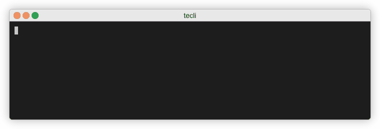
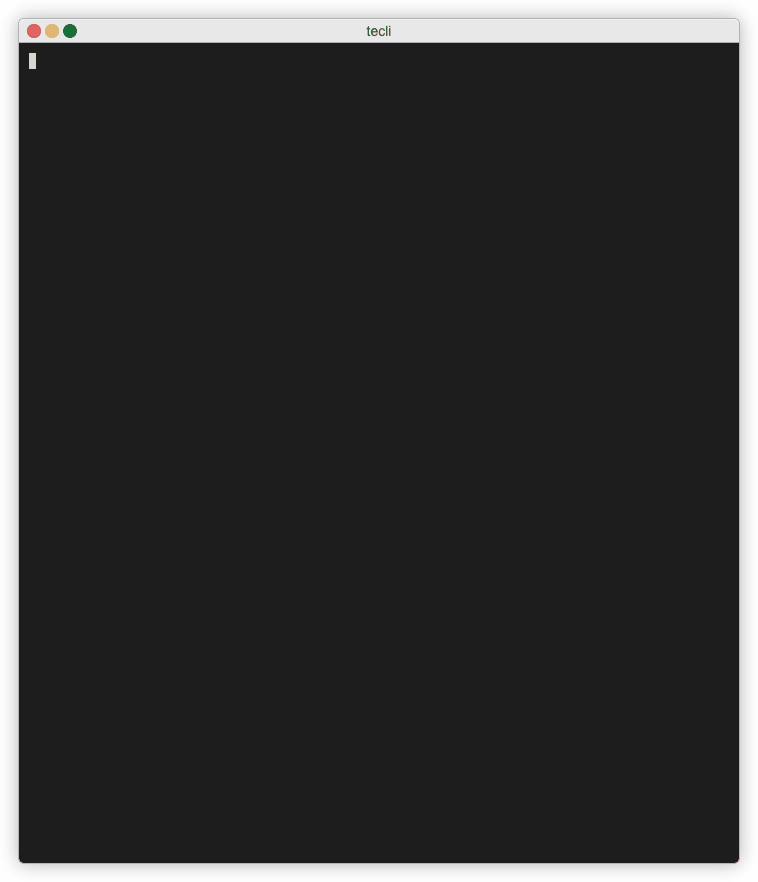

<!--

  ** DO NOT EDIT THIS FILE
  ** 
  ** This file was automatically generated by the [CLENCLI](https://github.com/awslabs/clencli)
  ** 1) Make all changes directly to YAML files: clencli/<file>.yaml
  ** 2) Run `clencli render template --name=<file>` to render this file
  **
  ** By following this practice we ensure standard and high-quality accross multiple projects.
  ** DO NOT EDIT THIS FILE

-->


 on [Unsplash](https://unsplash.com)](clencli/logo.jpeg)

> Photo by [Gabriel Menchaca](https://unsplash.com/gabrielmenchaca) on [Unsplash](https://unsplash.com)


# Command Line Interface for Terraform Enterprise/Cloud  ( tecli ) 

A non-official command line interface for Terraform Cloud/Enterprise.


## Table of Contents
---


 - [Usage](#usage) 
 - [Prerequisites](#prerequisites) 
 - [Installing](#installing) 


 - [Contributors](#contributors) 
 - [References](#references) 
 - [License](#license) 
 - [Copyright](#copyright) 


## Screenshots
---
<details open>
  <summary>Expand</summary>


|  |
|:--:| 
| *How to configure* |

|  |
|:--:| 
| *How to create a workspace* |

|  |
|:--:| 
| *How to create a workspace linked to a repository* |

|  |
|:--:| 
| *How to create a run* |

|  |
|:--:| 
| *How to read plan logs* |

|  |
|:--:| 
| *How to read apply logs* |

|  |
|:--:| 
| *How to delete a workspace* |

</details>


## Usage
---
<details open>
  <summary>Expand</summary>

`tecli --help`
</details>


## Prerequisites
---
<details>
  <summary>Expand</summary>

- [pre-requisites](https://gitlab.aws.dev/devops-aws/tecli/-/wikis/Pre-Requisites) - Pre-Requisites

</details>


## Installing
---
<details open>
  <summary>Expand</summary>

Look for the latest [package published](https://gitlab.aws.dev/devops-aws/tecli/-/packages) and download the binary according to your OS and platform.
For more information, check the [Installation](https://gitlab.aws.dev/devops-aws/tecli/-/wikis/Installation) Wiki page.
</details>


## Commands
```
Terraform Cloud/Enterprise Command Line

Usage:
   [command]

Available Commands:
  apply                 An apply represents the results of applying a Terraform Run's execution plan.
  configuration-version A configuration version is a resource used to reference the uploaded configuration files.
  configure             Configures tecli global settings
  help                  Help about any command
  o-auth-client         An OAuth Client represents the connection between an organization and a VCS provider.
  o-auth-token          The oauth-token object represents a VCS configuration which includes the OAuth connection and the associated OAuth token. This object is used when creating a workspace to identify which VCS connection to use.
  plan                  A plan represents the execution plan of a Run in a Terraform workspace.
  run                   A run performs a plan and apply, using a configuration version and the workspace’s current variables.
  ssh-key               The ssh-key object represents an SSH key which includes a name and the SSH private key. An organization can have multiple SSH keys available.
  version               Displays the version of tecli and all installed plugins
  workspace             Workspaces represent running infrastructure managed by Terraform.

Flags:
  -c, --config string          Override the default directory location of the application. Example --config=tecli to locate under the current working directory.
  -h, --help                   help for this command
  -l, --log string             Enable or disable logs (found at $HOME/.tecli/logs.json). Log outputs will be shown on default output. (default "disable")
      --log-file-path string   Log file path. (default "/Users/valterh/.tecli/logs.json")
  -o, --organization string    Terraform Cloud Organization name
  -p, --profile string         Use a specific profile from your credentials and configurations file. (default "default")
  -v, --verbosity string       Valid log level:panic,fatal,error,warn,info,debug,trace). (default "error")

Use " [command] --help" for more information about a command.
```


# Top Commands
```
tecli workspace list -o=Org-Name -p=Profile-Name
```


## Contributors
---
<details open>
  <summary>Expand</summary>

|     Name     |         Email        |       Role      |
|:------------:|:--------------------:|:---------------:|
|  Silva, Valter  |  valterh@amazon.com  |  AWS Professional Services - Cloud Architect  |
|  Dhingra, Prashit  |    |  AWS Professional Services - Cloud Architect  |

</details>


## References
---
<details open>
  <summary>Expand</summary>

  * [Terraform Cloud/Enterprise Go Client](https://github.com/hashicorp/go-tfe) - The official Go API client for Terraform Cloud/Enterprise.
  * [clencli](https://github.com/awslabs/clencli) - Cloud Engineer CLI
  * [terminalizer](https://github.com/faressoft/terminalizer) - Record your terminal and generate animated gif images or share a web player link terminalizer.com


</details>


## License
---
This project is licensed under the Apache License 2.0.

For more information please read [LICENSE](LICENSE).


## Copyright
---
```
Copyright Amazon.com, Inc. or its affiliates. All Rights Reserved.
```

