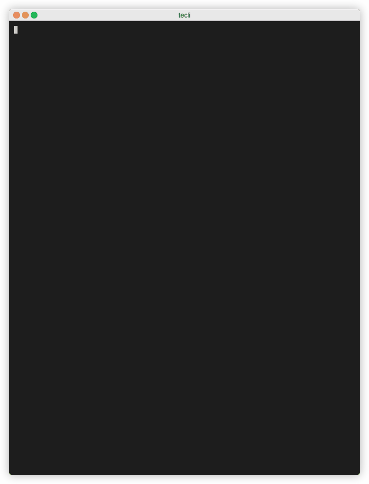
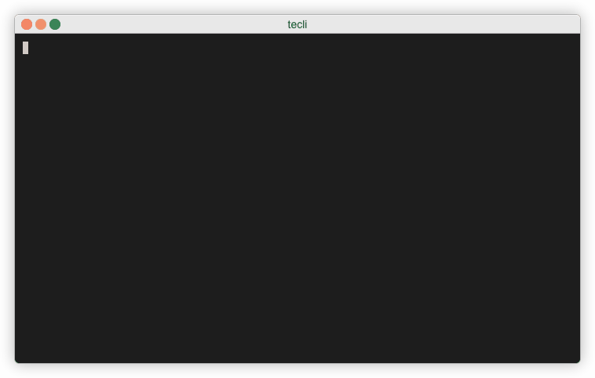
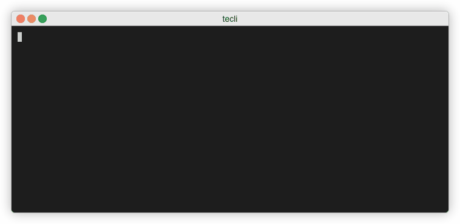
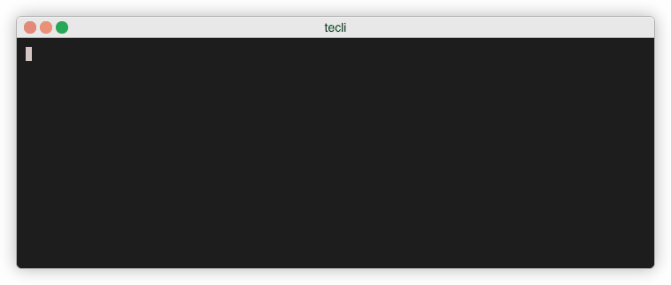

<!--

  ** DO NOT EDIT THIS FILE
  ** 
  ** This file was automatically generated by the [CLENCLI](https://github.com/awslabs/clencli)
  ** 1) Make all changes directly to YAML files: clencli/<file>.yaml
  ** 2) Run `clencli render template --name=<file>` to render this file
  **
  ** By following this practice we ensure standard and high-quality accross multiple projects.
  ** DO NOT EDIT THIS FILE

-->


 on [Unsplash](https://unsplash.com)](clencli/logo.jpeg)

> Photo by [Gabriel Menchaca](https://unsplash.com/gabrielmenchaca) on [Unsplash](https://unsplash.com)


[](https://github.com/awslabs/tecli/issues)[](https://github.com/awslabs/tecli/network)[](https://github.com/awslabs/tecli/stargazers)[](https://github.com/awslabs/tecli/blob/master/LICENSE)[](https://twitter.com/intent/tweet?text=Wow:&url=https%3A%2F%2Fgithub.com%2Fawslabs%2Ftecli)

# Command Line Interface for Terraform Enterprise/Cloud  ( tecli ) 

In a world where everything is Terraform, teams use [Terraform Cloud API](https://www.terraform.io/docs/cloud/api/index.html) to manage their workloads.
TECLI increases teams productivity by facilitating such interaction and by providing easy commands that can be executed on a terminal or on CI/CD systems.

## Table of Contents
---


 - [Usage](#usage) 
 - [Prerequisites](#prerequisites) 
 - [Installing](#installing) 


 - [Contributors](#contributors) 
 - [References](#references) 
 - [License](#license) 
 - [Copyright](#copyright) 


## Screenshots
---
<details open>
  <summary>Expand</summary>


|  |
|:--:| 
| *How to configure* |

|  |
|:--:| 
| *How to create a workspace* |

|  |
|:--:| 
| *How to create a workspace linked to a repository* |

|  |
|:--:| 
| *How to create a run* |

|  |
|:--:| 
| *How to read plan logs* |

|  |
|:--:| 
| *How to read apply logs* |

|  |
|:--:| 
| *How to delete a workspace* |

</details>


## Usage
---
<details open>
  <summary>Expand</summary>

`tecli --help`
</details>


## Prerequisites
---
<details>
  <summary>Expand</summary>

- [pre-requisites](https://github.com/awslabs/tecli/wiki/Pre-Requisites) - Pre-Requisites

</details>


## Installing
---
<details open>
  <summary>Expand</summary>

Look for the latest [release published](https://github.com/awslabs/tecli/releases) and download the binary according to your OS and platform.
For more information, check the [Installation](https://github.com/awslabs/tecli/wiki/Installation) Wiki page.
</details>


## Commands
```
Command Line Interface for Terraform Enterprise/Cloud

Usage:
   [command]

Available Commands:
  apply                 An apply represents the results of applying a Terraform Run's execution plan.
  configuration-version A configuration version is a resource used to reference the uploaded configuration files.
  configure             Configures tecli settings
  help                  Help about any command
  o-auth-client         An OAuth Client represents the connection between an organization and a VCS provider.
  o-auth-token          The oauth-token object represents a VCS configuration which includes the OAuth connection and the associated OAuth token. This object is used when creating a workspace to identify which VCS connection to use.
  plan                  A plan represents the execution plan of a Run in a Terraform workspace.
  run                   A run performs a plan and apply, using a configuration version and the workspace’s current variables.
  ssh-key               The ssh-key object represents an SSH key which includes a name and the SSH private key. An organization can have multiple SSH keys available.
  variable              Operations on variables.
  version               Displays the version of tecli and all installed plugins
  workspace             Workspaces represent running infrastructure managed by Terraform.

Flags:
  -c, --config string          Override the default directory location of the application. Example --config=tecli to locate under the current working directory.
  -h, --help                   help for this command
  -l, --log string             Enable or disable logs (found at $HOME/.tecli/logs.json). Log outputs will be shown on default output. (default "disable")
      --log-file-path string   Log file path.
  -o, --organization string    Terraform Cloud Organization name
  -p, --profile string         Use a specific profile from your credentials and configurations file. (default "default")
  -v, --verbosity string       Valid log level:panic,fatal,error,warn,info,debug,trace). (default "error")

Use " [command] --help" for more information about a command.
```


# Top Commands

All the following commands require [TEAM API TOKEN](https://www.terraform.io/docs/cloud/users-teams-organizations/api-tokens.html#team-api-tokens). 
You can run `tecli configure create` to configure TECLI options. Alternatively, you can export [environment varibles](https://github.com/awslabs/tecli/wiki/Environment-Variables).

To export environment variables:

```
# on Linux:
export TFC_TEAM_TOKEN=XXX

# on Windows (powershell):
$Env:TFC_TEAM_TOKEN="XXX"
```

To list all workspaces part of an organization:
```
tecli workspace list -o=${TFC_ORGANIZATION} -p=${PROFILE}
```

To find a workspace by name (instead of listing all workspaces and look for its ID):
```
tecli workspace find-by-name --organization=${TFC_ORGANIZATION} --name=${TFC_WORKSPACE_NAME}
```

To create a workspace and allow destroy plans:
```
tecli workspace create --organization=${TFC_ORGANIZATION} --name=${TFC_WORKSPACE_NAME} --allow-destroy-plan=true
```

To create a plan (if you want to upload your code to Terraform Cloud):

```
tecli configuration-version create --workspace-id=${WORKSPACE_ID}
tecli configuration-version upload --url=${CV_UPLOAD_URL} --path=./
tecli run create --workspace-id=${WORKSPACE_ID} --comment="${COMMENT}" 
```

To check the staus of a run:
```
tecli run read --id=${RUN_ID}
```

You combine some `BASH` scripting and check if your plan has finished:

``` 
while true; do STATUS=$(tecli run read --id=${RUN_ID} | jq -r ".Status"); if [ "${STATUS}" != "pending" ]; then break; else echo "RUN STATUS:${STATUS}, IF 'pending' TRY DISCARD PREVIOUS PLANS. SLEEP 5 seconds" && sleep 5; fi; done
```

To display the logs of a plan:
```
tecli plan logs --id=${PLAN_ID}
```

To leave a comment on a plan:

```
tecli run create --workspace-id=${WORKSPACE_ID} --comment="${COMMENT}" --is-destroy=true
```

To discard a run:
```
tecli run discard --id=${RUN_ID}
```

To discard all runs:
```
tecli run discard-all --workspace-id=${WORKSPACE_ID}
```

To apply a plan:
```
tecli run apply --id=${RUN_ID} --comment="${COMMENT}"
```

To display the apply logs:
```
tecli apply logs --id=${APPLY_ID}
```

To create a sensitive terraform variable:
```
tecli variable update --key=${VARIABLE_KEY} --value=${VARIABLE_VALUE} --workspace-id=${WORKSPACE_ID} --category=terraform --sensitive=true
```

To create a sensitive environment variable:
```
tecli variable create --key=${VARIABLE_KEY} --value=${VARIABLE_VALUE} --workspace-id=${WORKSPACE_ID} --category=env --sensitive=true

# AWS CLI ENVIRONMENT VARIABLES
tecli variable create --key=AWS_ACCESS_KEY_ID --value=${AWS_ACCESS_KEY_ID} --workspace-id=${WORKSPACE_ID} --category=env --sensitive=true
tecli variable create --key=AWS_SECRET_ACCESS_KEY --value=${AWS_SECRET_ACCESS_KEY} --workspace-id=${WORKSPACE_ID} --category=env --sensitive=true
tecli variable create --key=AWS_DEFAULT_REGION --value=${AWS_DEFAULT_REGION} --workspace-id=${WORKSPACE_ID} --category=env --sensitive=true

## IF YOU ALSO NEED TO EXPORT AWS_SESSION_TOKEN:
tecli variable create --key=AWS_SESSION_TOKEN --value=${AWS_SESSION_TOKEN} --workspace-id=${WORKSPACE_ID} --category=env --sensitive=true
```

To delete all variables (be careful):
```
tecli variable delete-all --workspace-id=${WORKSPACE_ID}
```


## Contributors
---
<details open>
  <summary>Expand</summary>

|     Name     |         Email        |       Role      |
|:------------:|:--------------------:|:---------------:|
|  Silva, Valter  |  valterh@amazon.com  |  AWS Professional Services - Cloud Architect  |
|  Dhingra, Prashit  |    |  AWS Professional Services - Cloud Architect  |

</details>


## References
---
<details open>
  <summary>Expand</summary>

  * [Terraform Cloud](https://www.terraform.io/docs/cloud/index.html) - Terraform Cloud is an application that helps teams use Terraform together.
  * [Terraform Cloud/Enterprise Go Client](https://github.com/hashicorp/go-tfe) - The official Go API client for Terraform Cloud/Enterprise.
  * [clencli](https://github.com/awslabs/clencli) - Cloud Engineer CLI
  * [terminalizer](https://github.com/faressoft/terminalizer) - Record your terminal and generate animated gif images or share a web player link terminalizer.com


</details>


## License
---
This project is licensed under the Apache License 2.0.

For more information please read [LICENSE](LICENSE).


## Copyright
---
```
Copyright Amazon.com, Inc. or its affiliates. All Rights Reserved.
```

